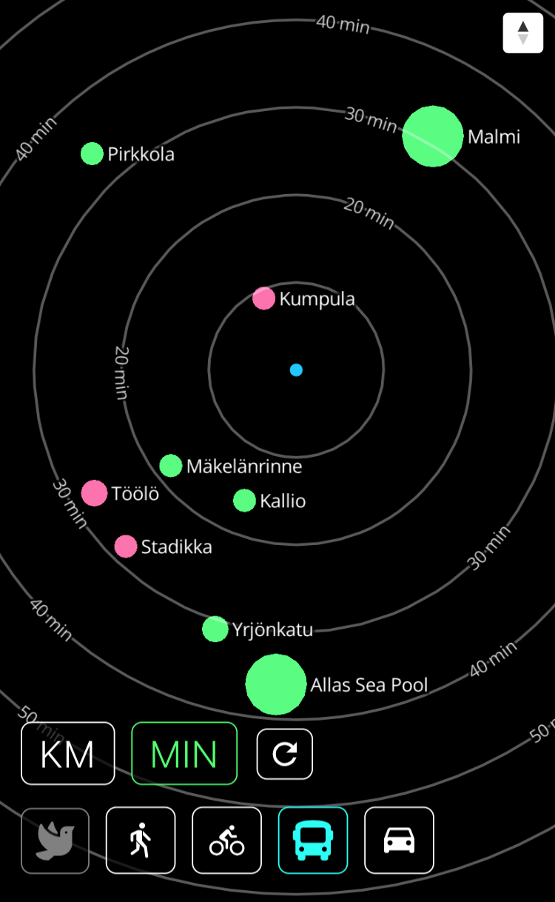

# Travel time map
A novel map projection is demonstrated via this map UI project. As opposed to featuring a traditional basemap, this app only shows the points of interest (POIs) and either distance or travel time zones (km/min) on the “map”.

## POC: Uimakartta
In [Uimakartta](https://uimakartta.firebaseapp.com/) app, travel times and distances to major swimming pools in Helsinki area are requested from [Digitransit Routing API](https://digitransit.fi/en/developers/apis/1-routing-api/). User can toggle the transport mode for which the travel times (or distances) are shown. If the transport mode “bird” is active, simple straight-line distances are presented. The menu buttons are enabled/disabled with respect to current zone mode (km/min) - transport mode -combination (e.g. travel times cannot be shown for straight-line distances). When a POI feature is clicked (or touched) on the map, the app opens the corresponding route in [reittiopas.hsl.fi](https://reittiopas.hsl.fi/). 

## Built With
* React, Redux & Thunk
* Mapbox GL JS & Turf.js

## Installation
```
$ git clone git@github.com:hellej/travel-time-map.git
$ cd travel-time-map
$ npm install
$ npm start
```
Update your Mapbox access token to `src/components/map/Map.js`<br>
Open browser to http://localhost:3000/

## License
[MIT](LICENSE)


